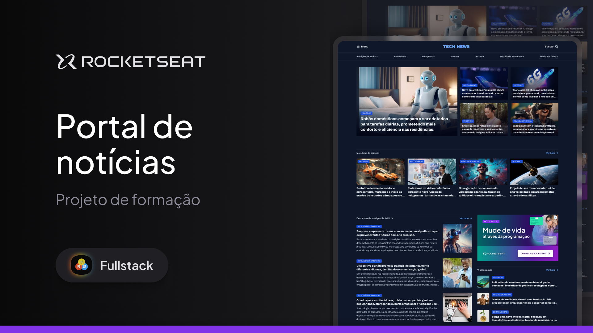

# Projeto Portal de Notícias

Esse é um projeto de uma pagina web que mostra a homepage de um portal de notícias sobre tecnologia para ser visualizado em um desktop. Este projeto foi desenvolvido utilizando HTML e CSS com o intuito de exercitar mais os conceitos de css aprendidos sobre display grid.

Link: https://jmarcos3.github.io/PortalDeNoticias/

## Tecnologias Utilizadas

- **HTML5**: Estrutura básica do site
- **CSS3**: Estilização e layout responsivo
